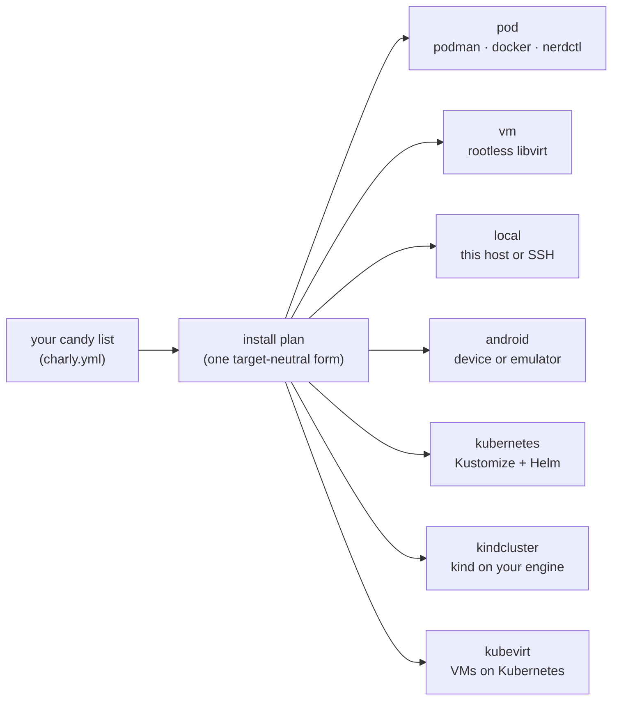

<!-- DO-NOT-EDIT — generated by `charly docs generate`; the opencharly/docs repo's deploy workflow regenerates this tree against its pinned charly checkout. -->

[](https://deepwiki.com/opencharly/charly)
[](/)

Write one list of **candies**. `charly` turns it into a container, a VM, a Kubernetes workload, a
host install, or an Android device — proves it on a throwaway test bed before anything real sees
it — and hands the whole loop to your agents through the same CLI you use.

---

## What charly can do

- **One recipe, seven destinations.** The same candy list deploys to `pod`, `vm`, `local`,
  `android`, `kubernetes`, `kindcluster` and `kubevirt`. Moving a deploy is a keyword change, not a
  rewrite.
- **Rootless by default.** Containers run as user-level systemd quadlets at uid 1000, VMs as
  rootless libvirt guests (`qemu:///session`), and a candybox can run its own rootless podman with
  zero added capabilities — no `--privileged`.
- **Real VMs, real clusters.** Boot VMs from cloud images, ISO installs, pacstrap/debootstrap,
  clones or KubeVirt container disks; pass a GPU through; stand up kind clusters or k3s in a VM and
  deploy into them.
- **Tests travel with the image.** Every candy carries a `plan:` — its acceptance test — baked into
  the image as an OCI label, so any pulled image can prove itself without its source.
- **Break it on purpose.** A deploy marked `disposable: true` is a check bed: one command builds,
  deploys, probes, destroys, rebuilds from scratch, probes again, and tears it all down.
- **Agents get the same keys.** The whole CLI is an MCP server; agent sessions, a TUI, pipelines
  and LLM PR review are built in, and every candy ships a skill your agent can load.
- **Everything is a plugin.** Every word charly understands — `pod:`, `vm:`, `check`, `http` — is
  registered by a plugin candy. The core is word-blind, so you can trim or replace any of it.
- **charly runs inside charly.** A candybox can build and test candyboxes; charly's own test beds
  run charly inside disposable VMs and pods.



## What's in the box

| Area | What you get | Key words |
|---|---|---|
| **Build** | Multi-stage Containerfiles from a candy list; images that carry their own capabilities and tests as `ai.opencharly.*` labels | `box build` `box validate` `box reconcile` · builders `pixi` `npm` `cargo` `aur` `mise` |
| **Distros** | Ready-made base boxes and coder boxes with the AI coding CLIs, runtimes and nested containers | fedora · arch · cachyos · debian · ubuntu · omarchy |
| **Engines & init** | Run on podman, docker or nerdctl, chosen per host for building and running; declare a `service:` once and charly composes the init the destination needs | `podman` `docker` `nerdctl` · supervisord · systemd · OpenRC |
| **Deploy** | Seven substrates, sidecars, Tailscale/Cloudflare tunnels, encrypted volumes, reversible host installs | `deploy add` `deploy del` `start` `stop` `config` |
| **VMs** | Rootless libvirt guests from seven sources, cloud-init, UEFI/Secure Boot, snapshots, GPU passthrough with a preemption arbiter | `charly vm` · `libvirt:` `spice:` |
| **Kubernetes** | Kustomize + Helm deploys, kind clusters, k3s inside a VM, the KubeVirt platform | `kubernetes:` `kindcluster:` `kubevirt:` · `kube:` `helm:` |
| **Test & verify** | More than 60 check verbs for files, ports, HTTP, browsers, Wayland/VNC desktops, Android, clusters and more; agent-graded steps for what a regex can't judge | `check box` `check live` `check run` · `cdp` `wl` `vnc` `adb` `kube` |
| **Agents** | MCP server, daemon-free agent sessions over local/SSH/gRPC, TUI, tmux terminals, pipelines, PR review, a skill marketplace | `mcp serve` `agent` `tui` `pipeline` `review` |
| **Desktops & devices** | Desktop themes and sessions, streaming hosts, JetKVM IP-KVM control (charly even installs onto the device), GPU udev rules, eBPF readiness | `theme` `session` · `jetkvm` `punktfunk` · `udev` `bpf` |
| **Packaging** | Signed native packages for six distro families; turn any candy's `packaging:` into deb/rpm/apk/pacman/ipk | `generate-packages` |

The reference pages on [opencharly.ai](/reference/providers/) are generated from
the same sources, so they cannot drift from the code.

---

## Install

`charly` runs on Linux (amd64 and arm64). Container deploys need podman (or docker); VM deploys
need libvirt — the packages pull in what they need.

**Fedora** — add `/etc/yum.repos.d/charly.repo`, then install:

```ini
[charly]
name=charly
baseurl=https://opencharly.github.io/charly-fedora/amd64
enabled=1
gpgcheck=1
gpgkey=https://opencharly.github.io/charly-fedora/RPM-GPG-KEY-charly
```

```sh
sudo dnf install charly
```

**Debian / Ubuntu** (replace `charly-debian` with `charly-ubuntu` on Ubuntu):

```sh
curl -fsSL https://opencharly.github.io/charly-debian/charly.gpg | sudo gpg --dearmor -o /etc/apt/keyrings/charly.gpg
echo "deb [signed-by=/etc/apt/keyrings/charly.gpg] https://opencharly.github.io/charly-debian/ stable main" | sudo tee /etc/apt/sources.list.d/charly.list
sudo apt update && sudo apt install charly
```

**Arch Linux / CachyOS**:

```sh
curl -fsSL https://opencharly.github.io/charly-arch/charly.gpg -o /tmp/charly.gpg
sudo pacman-key --add /tmp/charly.gpg
sudo pacman-key --lsign-key 978DFF11A951A830F7ADA2D4062B073E9D1BAE2E
printf '\n[charly]\nServer = https://opencharly.github.io/charly-arch/amd64\nSigLevel = Required\n' | sudo tee -a /etc/pacman.conf
sudo pacman -Sy charly
```

**Alpine**:

```sh
sudo wget -O /etc/apk/keys/charly.rsa.pub https://opencharly.github.io/charly-alpine/charly.rsa.pub
echo "https://opencharly.github.io/charly-alpine/amd64" | sudo tee -a /etc/apk/repositories
sudo apk update && sudo apk add charly
```

On arm64, replace `amd64` with `arm64` in the repository URLs. Each package comes in three
variants — `charly` (the everyday set), `charly-full` (adds GPU udev rules and the preemption
arbiter) and `charly-minimal` (doctor, clean, settings). There is also an OpenWrt feed and a
build for the JetKVM appliance; [all install options →](/start/install/)

Check the install:

```sh
charly version
charly doctor
```

---

## See it in 60 seconds

`--repo` reads any published project without cloning it. This is `box/tutorial-shell/charly.yml`
from [`opencharly/distro-fedora`](https://github.com/opencharly/distro-fedora) (its description omitted):

```yaml
tutorial-shell:
    candy:
        base: fedora
        candy:
            - '@github.com/opencharly/layer-supervisord:v2026.271.1817'
            - '@github.com/opencharly/layer-ripgrep:v2026.235.1653'
            - '@github.com/opencharly/pod-sshd:v2026.272.0324'
        plan:
            - check: composing the service candy next to the init candy wired sshd into the assembled supervisord config — a program block neither candy produces on its own
              id: tutorial-shell-service-wired-into-init
              file:
                file: /etc/supervisord.conf
                contains: "[program:sshd]"
```

```sh
charly --repo opencharly/distro-fedora box validate                    # the schema gate
charly --repo opencharly/distro-fedora box build tutorial-shell        # → multi-stage Containerfile → image
charly --repo opencharly/distro-fedora shell tutorial-shell            # → you are inside the candybox
charly --repo opencharly/distro-fedora check run check-tutorial-shell  # → the full test cycle, then tear down
```

The box's own `plan:` doesn't re-test `ripgrep` or `sshd` — each candy's plan proves itself, against
this same image. It checks only what the *composition* produced: `sshd` declared a service, charly
composed the init this destination needs, and the two met as a supervisord program. Build the same
candies onto a systemd machine and they meet as a systemd unit instead.

### Same box, different destination

These are real check beds from `opencharly/distro-fedora` — this box as a container, and a Fedora VM:

```yaml
# a CONTAINER
check-tutorial-shell:
    pod:
        image: tutorial-shell
        disposable: true

# a VM GUEST
check-fedora-vm:
    vm:
        from: fedora-vm
        disposable: true
        add_candy:
            - '@github.com/opencharly/layer-charly:v2026.274.0345'
```

The substrate is the keyword. Under it, both go through the same **install plan** — the one
target-neutral form every substrate realises its own way: the pod runs the built image, the VM is
booted and the candies are installed into the guest over SSH, `kubernetes:` emits a Kustomize tree,
`local:` installs onto a host and records every step so `charly deploy del` can undo it.

---

## Bring the pain forward

The oldest trick in DevOps: do the hard, risky part of shipping — the deploy, the integration, the
teardown — early and often, on a system built to be destroyed, so it is routine by the time it
matters. charly is built around it.

| Stage | What you write | What you run |
|---|---|---|
| **Build** | a `candy:` with `base:` and a candy list | `charly box build <box>` |
| **Run** | nothing more | `charly shell <box>` |
| **Deploy** | a substrate keyword — `pod:` `vm:` `local:` `kubernetes:` … | `charly deploy add`, `charly start` |
| **Evaluate** | a `plan:` on each candy | `charly check box`, `charly check live`, `charly check run` |

`charly check run <bed>` on a `disposable: true` deploy runs the whole chain: build the image and
check it, deploy it and wait for steady state, check the running candybox live, destroy and rebuild
it from scratch, check it again, and tear everything down. The install plan that bed just proved is
the one a production deploy realises — so the pain you brought forward is the pain you would
otherwise have met in production.

---

## Built for agents

**A box is an artifact; a candybox is a process.** A box is deliberately generous — full shell,
package manager, everything. The isolation is a property of the *running* container or VM: the
candybox. That is why it is safe to hand an agent everything inside one, and why
`disposable: true` is a statement about a running thing, not about a file.

- **MCP:** `charly mcp serve` exposes the whole command tree as MCP tools, over Streamable HTTP or
  stdio. The package also ships `charly-mcp` systemd units (not started by default).
- **Agent sessions:** `charly agent` and `charly tui` drive daemon-free agent sessions locally, over
  SSH or gRPC; `charly tmux` gives them isolated, snapshot-able terminals.
- **Pipelines and review:** `charly pipeline` runs agent workflows; `charly review` gives a PR a
  one-call LLM verdict.
- **Skills:** [opencharly/marketplace](https://github.com/opencharly/marketplace) ships a skill for
  every candy, box and command, plus reusable agents that drive check beds and return verbatim
  proof. It installs into Claude Code, Cursor, Codex CLI, Kimi Code and pi.
- **Rules:** [AGENTS.md](https://github.com/opencharly/charly/blob/main/AGENTS.md) is the one harness-neutral rulebook every agent reads.

---

## Everything and nothing

**charly brings everything and nothing.** Everything you might want comes as a candy, and nothing is
built in that you cannot trim out. Rather use a different tool for a job? Drop the candy that
provides it and wire in yours — charly does not care what provides a concern, only that the install
plan is satisfied.

```yaml
# everything — compose the kitchen sink
dev-box:
    candy:
        base: fedora
        candy:
            - '@github.com/opencharly/layer-ripgrep:v2026.235.1653'
            - '@github.com/opencharly/pod-sshd:v2026.272.0324'
            - '@github.com/opencharly/layer-charly:v2026.274.0345'

# nothing — the same box, trimmed to one concern
minimal-box:
    candy:
        base: fedora
        candy:
            - '@github.com/opencharly/pod-sshd:v2026.272.0324'
```

The trim is not a special case, because **every word is a plugin**. The core loads plugins and routes
each word to whichever one claims it; there is no `pod` case in a switch statement anywhere in it.

| Role | Examples |
|---|---|
| **substrate** — where a deploy lands (registered as a `kind` plus a `deploy` backend) | `pod` `vm` `local` `android` `kubernetes` `kindcluster` `kubevirt` |
| **kind** — the entity keywords | `candy` `distro` `agent` `theme` `task` |
| **verb** — probes a `plan:` can call | `file` `http` `cdp` `vnc` `adb` `kube` |
| **command** — `charly` subcommands | `deploy` `check` `vm` `mcp` `agent` |
| **step** — install operations | `service-custom` `helm-release` `reboot` |
| **builder** — multi-stage build patterns | `pixi` `npm` `cargo` `aur` `mise` |
| **engine** — container engines | `podman` `docker` `nerdctl` |

You extend charly by writing candies — in your own repo, referenced by git URL — and a substrate you
invent is the same kind of thing as `pod:`. The [provider index](/reference/providers/)
is the live census of every word and the plugin that serves it.

---

## How it works

1. **Everything starts as one resolved project.** charly reads every `charly.yml` it finds, follows
   `@github.com/...` references to other repos, and resolves each candy to a pinned CalVer version —
   so a box composes someone else's candy without vendoring it. `charly box reconcile` keeps the pins
   aligned.
2. **A plugin is reached the same way wherever it lives.** Some plugin candies are compiled into the
   binary; the rest run as separate processes over gRPC. Both speak one `Provider` contract, so
   placement is an operational choice, not an API difference. Every substrate's deploy backend runs
   out of process.
3. **Building and deploying share one input.** Building renders a multi-stage Containerfile from your
   candy list; deploying reduces the *same* list to the install plan, which each substrate realises
   its own way.
4. **The artifact carries its own description.** What a box provides and how to prove it are written
   into the image as `ai.opencharly.*` labels, so a machine that has never seen the source can
   inspect and test a pulled image.
5. **The schema comes first.** The `charly.yml` grammar is [CUE](https://cuelang.org/), in the
   [`opencharly/spec`](https://github.com/opencharly/spec) module; plugins ship CUE schemas for the
   words they register. The Go types are generated from it and load-time validation runs against it,
   so a grammar change cannot reach the code without going through the schema.

**Nesting is position in the file.** A member written *inside* a deploy's kind body deploys *into*
that deploy's candybox — a pod inside a VM, a host profile applied inside a guest. A member written
*beside* the kind body is brought up *alongside* it, on the shared network:

```yaml
# from charly.yml — the member is INSIDE the vm: body, so it is deployed INTO the guest
check-group:
    vm:
        from: eval-vm
        disposable: true
        check-group-member:
            local:
                from: check-group-app

# from opencharly/distro-fedora — the member is BESIDE the vm: body: a driver on the host
check-cross-vm-http:
    vm:
        from: web-vm
        disposable: true
    host-driver-vm:
        local:
            from: check-cross-local-driver
            host: local
```

A host-less `local:` member beside a VM or pod bed is refused at load time — it would otherwise
land on the machine running charly instead of in the bed.

**Podman and Docker are both first-class** for building and running; charly detects what is
installed, or you pin it per host. On a host with podman and systemd, every `pod:` deploy becomes a
user-level systemd quadlet (`charly-<name>.container`) that starts at boot; elsewhere the deploy runs
directly against the engine.

---

## Vocabulary

| Term | What it is |
|---|---|
| **candy** | the unit of configuration — everything else is made of candies |
| **layer** | a candy that installs one concern (no `base:`/`from:`) |
| **box** | a candy that composes other candies into a buildable machine (it has `base:` or `from:`) |
| **candybox** | the running, isolated form of a box — a container or VM guest. **The security boundary** |
| **deploy** | a named placement of a box on a substrate; `charly deploy add` / `del` manage the deploys on a machine |
| **substrate** | where a deploy lands — `pod` `vm` `local` `android` `kubernetes` `kindcluster` `kubevirt` |
| **plugin** / **provider** | a candy that teaches charly words; each word it registers is a provider |
| **plan** | a candy's ordered acceptance test, baked into its image |
| **install plan** | the target-neutral form of what a deploy installs, realised by each substrate |
| **check bed** | a `disposable: true` deploy — built to be destroyed, so charly may test it unattended |

The full glossary: [the words](/concepts/00-vocabulary/).

---

## Developing charly

**All charly development happens in the umbrella repo,
[opencharly/opencharly](https://github.com/opencharly/opencharly)** — one clone of the whole org,
with every repo (charly, the plugins, the distros, the docs) pinned as a submodule:

```sh
git clone --recurse-submodules https://github.com/opencharly/opencharly.git
cd opencharly
./charly/scripts/bootstrap-charly.sh     # builds ./charly/bin/charly, CalVer-stamped
```

Never edit a submodule in place: each session works in its own git worktree under
`.worktrees/<slug>/<repo>/`, branched off `origin/main`, and every change lands by pull request
through the `charly/pr-validator` gate. The umbrella's [AGENTS.md](https://github.com/opencharly/opencharly/blob/main/AGENTS.md)
has the full development model.

---

## Learn more

| You want | Go to |
|---|---|
| to build your first thing | [Quickstart](/start/quickstart/) → [Authoring a candy](/guides/authoring-a-candy/) |
| the ideas, in order, with runnable examples | [The concepts tour](/concepts/01-the-box-is-the-boundary/) |
| every command and flag | [The charly CLI](/guides/the-cli/) + the [CLI reference](/reference/cli/agent/) |
| "what implements `cdp:`?" | [Provider index](/reference/providers/) |
| something is broken | [Troubleshooting](/guides/troubleshooting/) |
| why the project looks like this | [The vision](VISION.md) · [What it is reacting to](GRIEVANCES.md) · [Liberation](LIBERATION.md) |
| to ask questions about the code | [DeepWiki](https://deepwiki.com/opencharly/charly) |
| dated history | [`CHANGELOG/`](https://github.com/opencharly/charly/tree/main/CHANGELOG), one file per CalVer version |

## License

MIT
